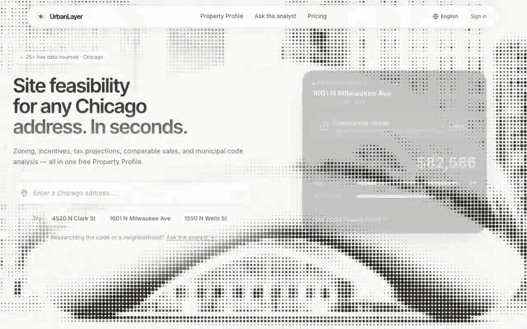
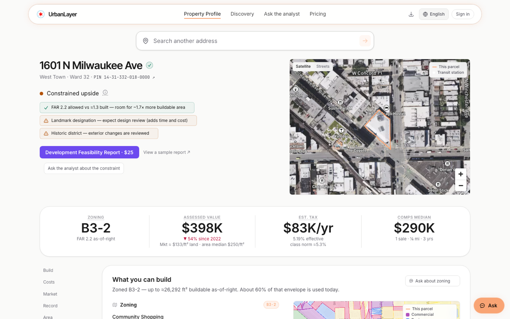
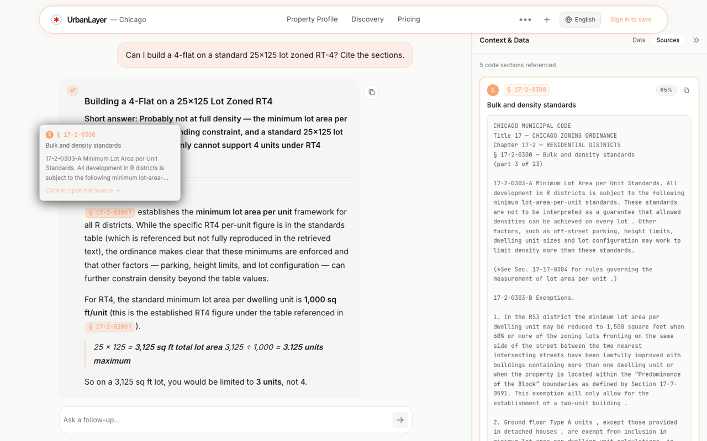
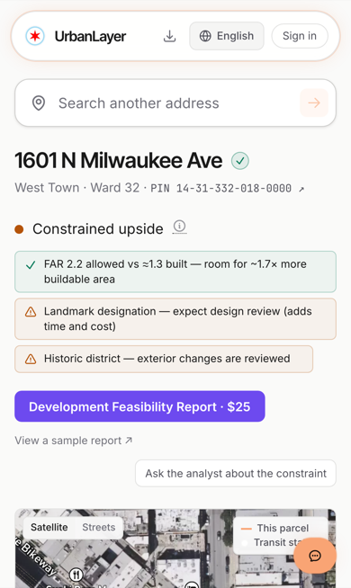
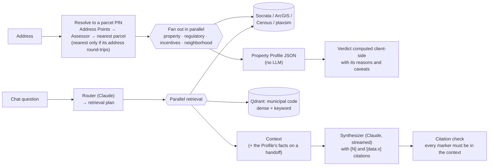

# UrbanLayer: Chicago

Parcel feasibility for Chicago real estate. Type an address and get the parcel's
**Property Profile**: zoning and what can be built, overlays and landmark status,
incentives, taxes, comparable sales, and maps. Free, no account. Then ask
follow-up questions in chat and get answers that cite the municipal code, or buy
a $25 Development Feasibility Report as a PDF.

**Live:** [urbanlayerchicago.com](https://urbanlayerchicago.com) ·
**Try:** [1601 N Milwaukee Ave](https://urbanlayerchicago.com/scorecard?address=1601%20N%20Milwaukee%20Ave)



## What it does

- **Property Profile** (`/scorecard`). A deterministic parcel dossier assembled
  from 25+ city, county and federal data sources, with no LLM in the path. It
  leads with a verdict ("Constrained upside: landmark building in a historic
  district") and the reasons behind it, then zoning and bulk standards, taxes,
  assessment history, comps, violations and neighborhood data. Derived figures
  show where they came from.
- **Chat.** Questions about the parcel you're looking at, or about the code and
  neighborhoods in general. Answers cite municipal-code sections (click through
  to the full text) and the datasets they used, with maps where relevant.
- **Development Feasibility Report** ($25). A PDF dossier for one parcel.
  [Sample](https://urbanlayerchicago.com/sample-report.pdf).
- **Property Discovery** (`/discovery`). Filter and rank all ~949k Chicago
  parcels (vacant land near transit, teardown candidates, underused commercial
  in a TIF) with a map and CSV export.
- English and Spanish throughout.

| Property Profile | Cited answers | Mobile |
|---|---|---|
|  |  |  |

## How it works



**Property Profile:** `GET /api/scorecard`
1. **Address → PIN**, in layers: Cook County Address Points, then Assessor
   addresses, then a distance-ordered nearest-parcel fallback. A fallback PIN
   is shown as the parcel's identity only if its own address round-trips to
   the input. Otherwise the profile says "unconfirmed" and caveats the parcel
   data, instead of silently describing a neighbor.
2. **Domain orchestrators** fan out with `asyncio.gather`, and a failed source
   becomes a caveat, not a failed page. Zoning standards come from a table
   regression-tested against the ordinance text in CI.
3. **Latency:** about a second when cached; 15–40 s for a first lookup, which
   waits on 25+ public APIs. The page says so while it loads.

**Chat:** `POST /chat` (server-sent events)
1. The **router** turns the question into a `RetrievalPlan` (sources,
   location, intent, time range, disclaimer). It's streamed first so the UI
   can show what's being fetched.
2. **Retrieval** runs Socrata/ArcGIS queries and vector search in parallel,
   then assembles a capped, deduplicated context.
3. The **synthesizer** streams the answer with citations. A server-side check
   flags any `[N]` or `[data:x]` that isn't backed by the retrieved context.

### Design decisions worth knowing

- **The Profile uses no LLM.** Facts people act on (zoning, tax, PIN) come from
  deterministic code with visible provenance. That makes it fast when cached,
  free to serve, and auditable. The LLM is for questions, not facts.
- **Chunking legal text.** One chunk per code section where it fits (~1,800
  characters), with the Title → Chapter → Section path repeated at the top of
  every chunk. Tables are flattened so each use × district cell is
  retrievable. 9,487 sections become 16,576 chunks.
- **Retrieval is dense plus a keyword boost; the reranker is off.** A
  cross-encoder improved the benchmark by one grade at ~13× the latency and
  hung the production CPUs, so it's off. [EVALS.md](EVALS.md) has the numbers.
- **Precomputed zoning standards.** The PDF report reads zoning standards
  extracted offline from full ordinance sections, with the parity-tested table
  winning on conflict. That keeps slow LLM work out of the paid request path.
- **Fail closed in production.** Missing auth, JWT or webhook secrets stop
  startup instead of silently degrading to dev behavior.

## Stack

| Layer | Choice |
|---|---|
| Backend | Python 3.11, FastAPI (async), SSE streaming |
| LLM | Claude Sonnet 4.6 (router, synthesizer), Claude Haiku 4.5 (conversation context, zoning extraction) |
| Retrieval | Qdrant; `BAAI/bge-base-en-v1.5` embeddings (local); keyword boost; optional `bge-reranker-v2-m3` |
| Data | Chicago and Cook County Socrata, ArcGIS, Census, FCC, FEMA, CCAO ptaxsim (SQLite) |
| Persistence | SQLite (aiosqlite, WAL) |
| Frontend | React, TypeScript, Vite, Tailwind; Mapbox GL + deck.gl; react-i18next |
| Ops | Docker Compose on a Hetzner VPS behind Cloudflare; GitHub Actions CI/CD; Sentry |

## Run it locally

Prerequisites: Python 3.11, Node 22.13+ or 24 (`frontend/.nvmrc`), Docker. Pango
is needed only for PDF reports (`brew install pango`).

```bash
make setup      # .venv + backend/dev deps, npm ci, copies the .env examples
make test       # all unit tests; no network, API keys, or Qdrant needed
make lint       # ruff + eslint
make dev        # Qdrant in Docker, backend on :8001, frontend on :5173
```

Open <http://localhost:5173/scorecard?address=1601%20N%20Milwaukee%20Ave>.

Or run the whole stack in Docker with `make up` (nginx on :80; set
`FRONTEND_PORT` to change it).

**What works without the large datasets:**

| Feature | Needs |
|---|---|
| Property Profile | nothing; it reads public APIs live. Tax figures need ptaxsim (below) |
| Chat | `ANTHROPIC_API_KEY` in `.env` |
| Chat citing the zoning code | `make seed-demo`: embeds a committed Title 16–17 sample (~30 s) |
| Tax estimates | `python scripts/download_ptaxsim.py` (9.4 GB) |
| Discovery | `python -m backend.discovery.index_build --community-areas 24` |
| Maps | `VITE_MAPBOX_TOKEN` in `frontend/.env`; pages work without it, minus tiles |

Every setting is listed in [`.env.example`](.env.example) with what happens when
it's empty.

**Full municipal code:** put the American Legal Publishing export
`chicago-il-codes.html` in the repo root, then run `python -m ingestion.update`
(parse → chunk → diff → embed only what changed; `--full` rebuilds).

## Testing and quality

| Check | What | Runs |
|---|---|---|
| Backend unit tests | 1,229 tests; a guard fails any test that touches the network | CI, `make test` |
| Integration tests | 61 tests against the live public APIs | on demand (`-m integration`) |
| Zoning parity | every hand-typed zoning standard diffed against the ordinance text | CI |
| Eval scorer tests | 37 tests of the grading code behind [EVALS.md](EVALS.md) | CI |
| Frontend | 207 vitest tests; `npm run build` (strict `tsc -b`) | CI |
| Lint | ruff; ESLint with 0 errors and a warning cap that can only go down | CI |
| Mobile layout | Playwright overflow audit, 8 routes × 5 phone sizes | `npm run test:mobile` |
| Security | CodeQL, Dependabot | CI, weekly |

Pushing to `main` deploys, and the deploy only runs if tests and lint pass.

**Evals.** Retrieval quality, router accuracy, end-to-end answers (with an LLM
judge), data-source coverage, and a fixed 100-address panel for Profile field
completeness. Latest results, their history since May, the failures they
caught, and their known weaknesses are in **[EVALS.md](EVALS.md)**.

## How I built this with Claude Code

Most commits are co-authored with Claude, and the trailers are kept on purpose.
My part was product direction, architecture, choosing and vetting data sources,
and deciding what "correct" means. Claude Code did most of the implementation.
What kept that honest:

- **Measurement before and after changes.** Retrieval changes were judged by
  the benchmark, Profile data by the 100-parcel panel, zoning numbers by the
  ordinance parity test. [EVALS.md](EVALS.md) lists what those caught.
- **CI as the gate.** CI runs the strict `tsc -b` build rather than the
  laxer `tsc --noEmit`, tests are hermetic, and lint blocks the deploy.
- **Verify against production, not the git log.** Deploys are checked against
  the live API and the served bundle.
- **Mistakes the process caught:**
  - The zoning reference table carried hand-typed heights and a lot-coverage
    rule that don't exist in Title 17. Diffing against the ordinance caught
    it, and the parity test now prevents it.
  - The first diagnosis of the report timeouts blamed memory; measuring showed
    the reranker.
  - A build-time "authoritative merge" quietly laundered bad values into a
    cached artifact. The fix applies the authority rule at serve time.

  Write-ups are in [`claude-context/archive/`](claude-context/archive/).
- **Context engineering.** [`CLAUDE.md`](CLAUDE.md) and
  [`claude-context/`](claude-context/) are the working memory for these
  sessions: the operating manual, design guides, and an archive of decisions
  and incidents.

## Known limitations and what I'd do next

- **First lookups are slow (15–40 s).** The same uncached lookup takes ~3 s
  from a laptop in Chicago, so most of the time looks like the server's round
  trips to city and county APIs rather than application code. Next: stream Profile sections as they resolve, cache per source, and track a
  per-phase latency target.
- **Evals.** Add gold answers and a correctness dimension, calibrate the judge
  against human grades, and add multi-turn, Spanish and prompt-injection cases
  sampled from real traffic. Details in [EVALS.md](EVALS.md).
- **Router robustness.** Use structured outputs for the retrieval plan (it's
  free-text JSON today, so a malformed reply fails the turn), set temperature
  0, and run an ablation to see whether Haiku can route as well as Sonnet.
- **Code structure.** `backend/main.py` (~2,400 lines) should be split into
  routers by domain, following the existing `discovery` router, and
  `report_builder.py` split by stage.
- **Reproducible builds.** Lock Python dependencies (currently `>=`) and scan
  the production image, not just the lockfile.

## Project layout

```
backend/            FastAPI app
  main.py             routes: chat SSE, Profile, report, auth, payments, admin
  router.py           Claude → RetrievalPlan
  synthesizer.py      streamed answer with citations
  citations.py        checks every citation against the context
  retrieval/          data-source clients + domain orchestrators, vector search
  discovery/          parcel filter/rank engine
  tests/
frontend/src/       React app (components/, discovery/, lib/, locales/en|es)
ingestion/          municipal code: parse → chunk → embed, incremental updates
eval/               eval suites, results/, tests of the scorers
deploy/             deploy script, systemd timers, hardening runbook
claude-context/     design docs, decision records, incident write-ups
```

## Deployment

A push to `main` runs CI (tests, lint, build), then deploys over SSH to a
single VPS behind Cloudflare with `docker compose up --build`. Server hardening
(origin firewall, least-privilege deploy user, fail-closed config, backups) is
in [`deploy/hardening-runbook.md`](deploy/hardening-runbook.md).
